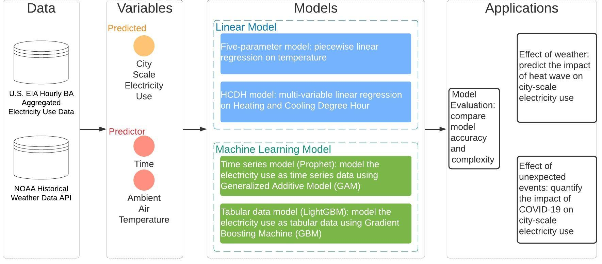

# City-Scale Electricity Use Analysis

This is the official repository that implements the following paper:

> *Zhe Wang, Han Li, Tianzhen Hong, Mary Ann Piette. 2021. Predicting City-Scale Daily Electricity Consumption Using Data-Driven Models. Submitted to Advance in Applied Energy*

<!--
[[slides]](docs/slides.pdf)[[paper]](https://dl.acm.org/doi/10.1145/3408308.3427980)
-->

# Overview
We developed data-driven models to predict city-scale electricity consumption.
- We developed and compared four models: (1) five parameter change-point model, (2) Heating/Cooling Degree Hour model, (3) time series decomposed model implemented by Facebook Prophet, and (4) Gradient Boosting Machine implemented by Microsoft lightGBM.
- We applied our models to explore how extreme weather events (e.g., heat waves) and unexpected public health events (e.g. COVID-19 pandemic) influenced each city’s electricity demand




# Code Usage
### Clone repository
<!--
```
git clone https://github.com/INFERLab/COHORT.git
cd COHORT
```
-->

### Set up the environment 
Set up the virtual environment with your preferred environment/package manager.

The instruction here is based on **conda**. ([Install conda](https://docs.anaconda.com/anaconda/install/))
```
conda create --name cityEleEnv python=3.8 -c conda-forge -f requirements.txt
conda activate cityEleEnv
```

### Structure
``bin``: Runnable programs, including Python scripts and Jupyter Notebooks
``data``: Raw data, including city-level electricity consumption and weather data
``docs``: Manuscript submitted version
``results``: Cleaned-up data, generated figures and tables


### Running
You can replicate our experiments, generate figures and tables used in the manuscript using the Jupyter notebooks saved in ``bin``: `section3.1 EDA.ipynb`, `section3.2 linear model.ipynb`, `section3.3 time-series model.ipynb`, `section3.4 tabular data model.ipynb`, `section4.1 model comparison.ipynb`, `section4.2 heat wave.ipynb`, `section4.3 convid.ipynb`

*Notes.*
- Official Documentation site of [Facebook Prophet](https://facebook.github.io/prophet/).
- Official Documentation site of [Microsoft lightGBM](https://github.com/Microsoft/LightGBM). 

### Feedback

Feel free to send any questions/feedback to: [Zhe Wang](mailto:zwang5@lbl.gov ) or [Tianzhen Hong](mailto:thong@lbl.gov)

### Citation

If you use our code, please cite us as follows:

<!--
```
@inproceedings{Chen2020COHORT,
author = {Chen, Bingqing and Francis, Jonathan and Pritoni, Marco and Kar, Soummya and Berg\'{e}s, Mario},
title = {COHORT: Coordination of Heterogeneous Thermostatically Controlled Loads for Demand Flexibility},
year = {2020},
isbn = {9781450380614},
publisher = {Association for Computing Machinery},
address = {New York, NY, USA},
url = {https://doi.org/10.1145/3408308.3427980},
doi = {10.1145/3408308.3427980},
booktitle = {Proceedings of the 7th ACM International Conference on Systems for Energy-Efficient Buildings, Cities, and Transportation},
pages = {31–40},
numpages = {10},
keywords = {demand response, smart thermostats, TCLs, distributed control},
location = {Virtual Event, Japan},
series = {BuildSys '20}
}
```
-->
